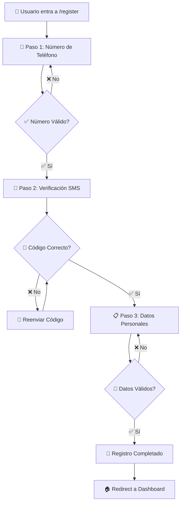

# 📝 Proceso de Registro - Documentación

## 🎯 Descripción General

El proceso de registro de UBIKHA es un **flujo multi-paso de 3 etapas** diseñado para capturar la información del usuario de forma progresiva y validar su identidad mediante verificación telefónica.

## 🚀 Flujo del Proceso



## 🏗️ Arquitectura de Componentes

### Componentes Principales

1. **`RegisterPage.tsx`** - Componente orquestador principal
2. **`RegisterStepOne.tsx`** - Captura número de teléfono
3. **`RegisterStepTwo.tsx`** - Verificación de código SMS
4. **`RegisterStepThree.tsx`** - Datos personales y contraseña

### Estructura de Datos

```typescript
interface FormData {
  num_celular: string;           // Paso 1
  verification_code: string;     // Paso 2
  nombres: string;              // Paso 3
  apellidos: string;            // Paso 3
  fecha_nacimiento: string;     // Paso 3
  email: string;                // Paso 3
  password: string;             // Paso 3
}
```

## 📱 Paso 1: Número de Teléfono

### Propósito
Capturar y validar el número de teléfono del usuario como identificador principal.

### Campos
- **Número de teléfono** (requerido)
  - Formato: 9 dígitos
  - Validación: Debe empezar con 9 (números peruanos)
  - Máximo: 9 caracteres numéricos

### Validaciones
```typescript
const phoneRegex = /^9\d{8}$/; // Números de Perú
```

### Funcionalidades
- ✅ Validación en tiempo real
- ✅ Limpieza automática de caracteres no numéricos
- ✅ Botones de redes sociales (deshabilitados - próximamente)
- ✅ Navegación hacia atrás (Login)

### Ubicación
- **Archivo:** `src/components/ui/RegisterStepOne/RegisterStepOne.tsx`
- **Estilos:** `src/components/ui/RegisterStepOne/RegisterStepOne.css`

---

## 🔢 Paso 2: Verificación SMS

### Propósito
Verificar la identidad del usuario mediante código SMS de 6 dígitos.

### Campos
- **Código de verificación** (6 dígitos)
  - Formato: 6 inputs individuales numéricos
  - Validación: Solo números
  - Auto-focus y navegación automática entre campos

### Funcionalidades
- ✅ **Auto-avance**: Al escribir un dígito, avanza al siguiente campo
- ✅ **Backspace inteligente**: Navega hacia atrás automáticamente
- ✅ **Pegar código**: Soporta pegar código completo de 6 dígitos
- ✅ **Reenvío de código**: Botón para solicitar nuevo código
- ✅ **Modo desarrollo**: Acepta cualquier código de 6 dígitos

### Validaciones
```typescript
// Solo dígitos numéricos
if (value && !/^\d$/.test(value)) return;

// Código completo de 6 dígitos
if (fullCode.length !== 6) {
  setError('Por favor ingresa el código completo de 6 dígitos');
}
```

### Ubicación
- **Archivo:** `src/components/ui/RegisterStepTwo/RegisterStepTwo.tsx`
- **Estilos:** `src/components/ui/RegisterStepTwo/RegisterStepTwo.css`

### Estado de Desarrollo
> 💡 **Nota:** Actualmente en modo desarrollo - acepta cualquier código de 6 dígitos.  
> Para producción se debe implementar integración con servicio SMS real.

---

## 📋 Paso 3: Datos Personales

### Propósito
Capturar información personal completa del usuario y configurar credenciales de acceso.

### Campos Requeridos

| Campo | Tipo | Validación | Descripción |
|-------|------|------------|-------------|
| **Nombres** | `text` | Min: 2 caracteres | Nombre que aparece en DNI |
| **Apellidos** | `text` | Min: 2 caracteres | Apellidos que aparecen en DNI |
| **Fecha de Nacimiento** | `date` | Edad: 18-100 años | Fecha de nacimiento válida |
| **Email** | `email` | Formato email válido | Correo electrónico único |
| **Contraseña** | `password` | 6-20 caracteres | Contraseña de acceso |
| **Confirmar Contraseña** | `password` | Igual a contraseña | Confirmación de contraseña |

### Validaciones Específicas

#### Edad Mínima
```typescript
const birthDate = new Date(fecha_nacimiento);
const age = today.getFullYear() - birthDate.getFullYear();

if (age < 18) {
  error = 'Debes ser mayor de 18 años';
}
```

#### Contraseñas
```typescript
// Contraseña principal
if (password.length < 6) {
  error = 'La contraseña debe tener al menos 6 caracteres';
}

// Confirmación
if (password !== confirm_password) {
  error = 'Las contraseñas no coinciden';
}
```

#### Email
```typescript
const emailRegex = /^[^\s@]+@[^\s@]+\.[^\s@]+$/;
if (!emailRegex.test(email)) {
  error = 'Ingresa un email válido';
}
```

### Funcionalidades
- ✅ **Validación en tiempo real**: Errores se muestran mientras se escribe
- ✅ **Limpieza automática**: Se eliminan espacios en blanco extras
- ✅ **Fecha inteligente**: Rangos de fecha automáticos (18-100 años)
- ✅ **Estado de carga**: Loading durante el envío
- ✅ **Manejo de errores**: Errores específicos por campo

### Ubicación
- **Archivo:** `src/components/ui/RegisterStepThree/RegisterStepThree.tsx`
- **Estilos:** `src/components/ui/RegisterStepThree/RegisterStepThree.css`

---

## 🎛️ Gestión de Estado

### RegisterPage.tsx - Orquestador Principal

```typescript
const [currentStep, setCurrentStep] = useState(1); // Paso actual
const [formData, setFormData] = useState({...});   // Datos acumulados
```

### Navegación Entre Pasos

#### Avanzar (Next)
```typescript
const handleNextStep = (stepData: any) => {
  setFormData({ ...formData, ...stepData });
  setCurrentStep(currentStep + 1);
};
```

#### Retroceder (Back)
```typescript
const handlePrevStep = () => {
  if (currentStep > 1) {
    setCurrentStep(currentStep - 1);
  }
};
```

### Flujo de Datos
1. **Paso 1** → `{ num_celular: "999999999" }`
2. **Paso 2** → `{ num_celular: "999999999", verification_code: "123456" }`
3. **Paso 3** → `{ ...datosAnteriores, nombres: "...", apellidos: "...", ... }`

---

## 🛠️ Integración con Backend

### Estado Actual: Modo Desarrollo
```typescript
// RegisterPage.tsx - líneas 58-68
// TODO: Llamar al servicio de registro cuando esté implementado
// try {
//   await authService.register(completeData);
//   navigate('/login');
// } catch (error) {
//   console.error('Error en registro:', error);
// }

// Por ahora, solo navegamos al dashboard
alert('Registro completado (simulado). Datos en consola.');
navigate('/home-arrendatario');
```

### Implementación Futura
Para conectar con el backend, se debe:

1. **Crear endpoint de registro** en `authService.ts`
2. **Implementar servicio SMS** para verificación
3. **Manejar errores de registro** (email duplicado, etc.)
4. **Configurar redirección** según tipo de usuario

```typescript
// Ejemplo de implementación futura
const handleFinalSubmit = async (finalData: any) => {
  try {
    const response = await authService.register({
      ...formData,
      ...finalData
    });
    
    // Redirigir según rol del usuario
    const redirectPath = authService.getRedirectPath(response.rol);
    navigate(redirectPath);
    
  } catch (error) {
    setError('Error al registrar usuario');
  }
};
```

---

## 🎨 Estilos y UX

### Características de Diseño
- **Diseño responsivo**: Funciona en móviles y desktop
- **Feedback visual**: Estados de error, carga y éxito
- **Navegación intuitiva**: Botones de retroceso en cada paso
- **Consistencia visual**: Misma estructura en los 3 pasos

### Paleta de Colores (basada en CSS existente)
- **Primario**: Azul UBIKHA
- **Errores**: Rojo para campos inválidos
- **Éxito**: Verde para validaciones correctas
- **Fondo**: Gris claro (`#f8fafc`)

---

## 🚦 Rutas y Navegación

### Configuración en AppRouter.tsx
```typescript
<Route path="/register" element={<RegisterPage />} />
```

### Flujo de Navegación
```
/login → [Click "Registrarse"] → /register → [3 pasos] → /home-arrendatario
```

### Navegación Interna
- **Paso 1** → Back: `/login`
- **Paso 2** → Back: Paso 1
- **Paso 3** → Back: Paso 2
- **Completado** → Redirect: `/home-arrendatario`

---

## 🔧 Para Desarrolladores

### Comandos Útiles
```bash
npm run dev    # Servidor de desarrollo
npm run build  # Build de producción
npm run lint   # Verificar código
```

### Testing Manual
1. Ir a `http://localhost:5173/register`
2. **Paso 1**: Usar cualquier número de 9 dígitos que empiece con 9
3. **Paso 2**: Usar cualquier código de 6 dígitos (modo desarrollo)
4. **Paso 3**: Llenar todos los campos con datos válidos

### Debug
- **Console logs**: Cada paso imprime los datos acumulados
- **React DevTools**: Inspeccionar estado de `RegisterPage`
- **Network tab**: Preparado para futuras llamadas API

---

## ✅ Estado del Desarrollo

### ✅ Completado
- [x] Estructura de 3 pasos
- [x] Validaciones por campo
- [x] Navegación entre pasos
- [x] Interfaz de usuario responsive
- [x] Manejo de errores
- [x] Integración con sistema de rutas

### ⏳ Pendiente
- [ ] Integración con backend real
- [ ] Servicio SMS real para verificación
- [ ] Manejo de usuarios duplicados
- [ ] Tests unitarios
- [ ] Internacionalización (i18n)
- [ ] Botones de redes sociales funcionales

### 🐛 Issues Conocidos
- Los botones de Google/Facebook están deshabilitados
- El código SMS acepta cualquier valor (modo desarrollo)
- No hay persistencia en localStorage (se pierde al recargar)

---

## 📚 Referencias Técnicas

### Componentes Base Utilizados
- `Input` - Campo de entrada reutilizable
- `Button` - Botón base con estados
- `React Router` - Navegación SPA

### Dependencias
- `react-icons` - Iconografía (IoArrowBack, FaFacebookF, FcGoogle)
- `react-router-dom` - Enrutamiento
- `typescript` - Tipado estático

### Archivos Relacionados
```
src/
├── components/ui/
│   ├── RegisterStepOne/
│   ├── RegisterStepTwo/
│   ├── RegisterStepThree/
│   └── index.ts (exports)
├── pages/
│   ├── RegisterPage.tsx
│   └── index.ts (exports)
└── router/
    └── AppRouter.tsx
```

---

*Documentación generada el: {{ fecha actual }}*  
*Versión: 1.0.0*  
*Estado: Desarrollo (Plantillas listas para integración)*